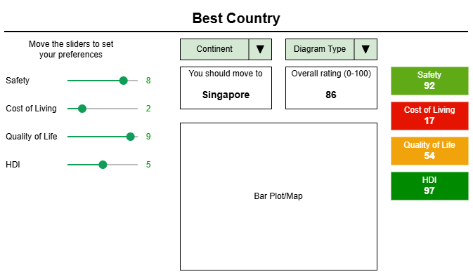
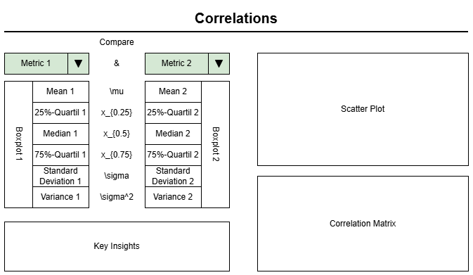

# Global Data Analysis in MS Excel

## Introduction

The following project provides an analysis of popular metrics that define coutries around the world. The result of the analysis will be condensed into two interactive dashboards in MS Excel. This project is designed to not only create knowledge from data, but also to give an introduction to advanced data analytics features in Excel.

The following documentation will not cover all steps for you to scrape the data and build those dashboards yourself if you are not experienced in Excel. It is only a short summary to provide context for the project. I strongly recommend to watch this video on YouTube, as it provides the basic knowledge needed for the analysis in Excel: https://www.youtube.com/watch?v=pCJ15nGFgVg

The data used in this project can be found on the following websites:

* https://www.wikipedia.org/
* https://worldpopulationreview.com/
* https://www.numbeo.com/cost-of-living/
* https://ourworldindata.org/grapher/economic-inequality-gini-index
* https://www.economist.com/interactive/big-mac-index
* https://www.worldhappiness.report/

This project is for **educational purposes only**. I do not claim ownership of the underlying datasets. All intellectual property rights belong to their respective creators and providers. Moreover, I cannot guarantee the absolute accuracy or timeliness of the external data used.

## Objective

As mentioned above, the goal of the analysis is, to scrape and clean interesting data from the web and to gain knowledge through interactive dashboards, which make the data accessible to everyone.

Why did I use Excel for this and not a BI-tool like Tableau or Power BI? This project is supposed to teach Excel, because is one of the most used and most useful desktop-applications of all time. Although there are better Applications for this specific purpose, cleaning data and building dashboards in Excel teaches a lot about all sorts of Excel functions that can be used for many use cases.

Before I began collecting data, I drew basic templates for the dashboards in draw.io, to define what I wanted them to look like. Why did I not build the dashboards from scratch in Excel? Two reasons:

1. The situation of being given a task in a certain scope is very likely to occur in most jobs, which makes this project good practice for professional life.
2. When doing something, without a goal, one tends to do what works easily in the given circumstances without learning a lot. When doing something with a goal, one will make the goal possible which may involve changing the circumstances.

The first dashboard is supposed to

