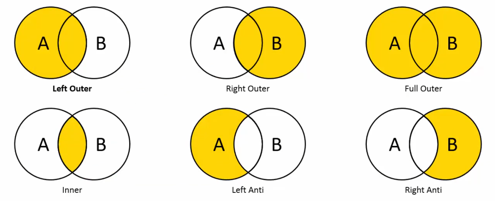

# Global Data Analysis in MS Excel

## Introduction

The following project provides an analysis of popular metrics that define countries around the world. The result of the analysis will be condensed into two interactive dashboards in MS Excel. This project is designed to not only create knowledge from data, but also to give an introduction to advanced data analytics features in Excel.

The following documentation will not cover all steps for you to scrape the data and build those dashboards yourself if you are not experienced in Excel. It is only a short summary to provide context for the project. I strongly recommend to watch this video on YouTube, as it provides the basic knowledge needed for the analysis in Excel: https://www.youtube.com/watch?v=pCJ15nGFgVg

The data used in this project can be found on the following websites:

* https://www.wikipedia.org/
* https://worldpopulationreview.com/
* https://www.numbeo.com/cost-of-living/
* https://ourworldindata.org/grapher/economic-inequality-gini-index
* https://www.economist.com/interactive/big-mac-index
* https://www.worldhappiness.report/

This project is for **educational purposes only**. I do not claim ownership of the underlying datasets. All intellectual property rights belong to their respective creators and providers. Moreover, I cannot guarantee the absolute accuracy or timeliness of the external data used.

## Objective

As mentioned above, the goal of the analysis is to scrape and clean interesting data from the web and to gain knowledge through interactive dashboards, which make the data accessible to everyone.

Why did I use Excel for this and not a BI-tool like Tableau or Power BI? This project is supposed to teach Excel, because it is one of the most used and most useful desktop-applications of all time. Although there are better applications for this specific purpose, cleaning data and building dashboards in Excel teaches a lot about all sorts of Excel functions that can be used for many use cases.

Before I began collecting data, I drew basic templates for the dashboards in draw.io, to define what I wanted them to look like. Why did I not build the dashboards from scratch in Excel? Two reasons:

1. Being given a task within a specific scope is a common occurrence in most jobs, which makes this project a valuable learning experience for the professional world.
2. Without a goal, one tends to do whatever works easily in the given circumstances without learning much. However, when doing something with a goal, one will make it possible, which may involve changing the circumstances.

For the analysis the following data are of interest:

* **Continent** of each country as a nominal variable that allows filtering
* **Population** as the central metric variable to classify countries
* **GDP** (gross domestic product) and **GNI** (gross national income) per capita to roughly measure income (or rather the average economic output of each person)
* **Gini coefficient** to measure income inequality
* **HDI** (human development index)
* The Economists **Big Mac index** to indicate whether a country holds an over- or undervalued currency
* Mean years of **life expectancy** and **schooling**
* **Safety**, **health care** and **happiness** to measure quality of life
* ...

The **first dashboard** is supposed to give the user an idea of how countries compare, depending on what is important to the user. Therefore, there are sliders on the left to weight different metrics on a scale from 0 to 10. In the background (on a seperate, hidden sheet), a rating will be calculated on a scale from 0 to 100 that includes the given weights. The country with the highest rating will be displayed with its overall rating and other KPIs which describe the metrics (also on a scale from 0 to 100). The KPIs change their color depending on the rating. Furthermore, the user may filter a specific continent and a diagram that is being displayed in the middle of the dashboard (map or bar chart).

The **second dashboard** is rather on the technical side: It compares two different metrics, that the user is interested in. Several statistical variables that are calculated using all countries data are shown below the metrics. Two boxplots provide a concise overview of the distributions. On the right-hand side, there is a scatter plot to visualize the correlation between the selected metrics and a correlation matrix to show the correlations of all metrics (independent of the selection). Key insights at the bottom explain the selected metrics and the strength of the correlation for non-nerds.

## Data collection and cleansing

For data collection, you can use Excels feature to get data from the web: `Data -> Get Data -> From Other Sources -> From Web`. After adding an URL, Excels Power Query engine will extract the tables from the website by searching for HTML-tags such as `<table>`. You may now select the table you want to extract and save it locally as an Excel file (in my repository the data is saved in the folder `'Separate_Data'`).

To merge the tables from separate tables/files into a "mother-table" that contains all data you can use the Power Query editor. First, you have to create connections for every file to later edit and transform them using Power Query: `Data -> Get Data -> From File -> From Excel Workbook -> Import -> Load to... -> Only Create Connection -> OK`. By double clicking on one of the queries in the right column, you will open the Power Query editor. Now you can merge the queries by navigating to `Home -> Merge Queries`. It makes sense to start from the dataset with the most entries (in our case the countries by continent) to set a standard for the common column and successively merge the smaller datasets into the main one. You can now select the second table to merge with and the column, both tables share (the country-column). To not lose any data, you should select 'Full Outer' as a join type, as it keeps all rows from both tables.

I'd also not recommend the fuzzy matching, to stay in full control and get a better understanding of how to manually clean data.

To handle the entries that didn't match, you can replace the names of the countries in the newly merged table with the ones of the main table. Every change/transformation generates a new step in the column on the right and can be edited there or even be coded manually, if you are familiar with the M language. Although you could do this in the main table, if you perform the changes in the newly merged, separate tables, you'll keep the main table clean. In our case, the countries that are often referred to differently are as follows:

* Czechia - Czech Republic - Czech Rep.
* DR Congo - Democratic Republic of the Congo - Democratic Republic of Congo
* Cape Verde - Capo Verde
* Turkey - Türkiye
* United Kingdom - Great Britain - Britain
* United Arab Emirates - UAE
* ...

Before loading the data, you may also delete unnecessary or double columns, change columns or their names, name transformations, set correct data types, and much more. You should never perfom any changes in the table you load into a spreadsheet! If you want to make changes using the Power Query editor later, the changes made in the sheet will be overwritten and won't apply to your data anymore.

## First Dashboard (Best Country)

To get started, add two sheets to your workbook containing the data: One for the dashboard (`Best Country`), another for the calculations in the backgrond (`Best Country (help)`). In the help-sheet, you can now insert the data for this dashboard using dynamic arrays: `=IF(main_table[HDI (2023)]<>0; main_table[HDI (2023)]; "")`. The if-condition ensures that all empty entries which may contain a '0' will be cleared entirely. This is important, because we don't want cells containing '0' , as they would skew the calculations. Now, add new columns with standardized values from 0 to 1: `=IFERROR((L5-MIN(L5#))/(MAX(L5#)-MIN(L5#)); "")`. You can also save the min- and max-values in separate cells to keep it tidy. If it is bad for the metric to have an high value (e. g. Gini coefficient), add `1-` before the calculation, because we want the standardized values to go from 0 (bad) to 1 (good). The rating for each country is calculated as a weighted average of all standardized metrics times 100:

$$
\frac{\text{metric}_1\cdot\text{weight}_1 + ... + \text{metric}_n\cdot\text{weight}_n}{\text{weight}_1 + ... + \text{weight}_n}\cdot 100
$$

The user can input the weights via spin buttons. To insert a spin button, you must first unhide the developer tab. Now you can insert form controls like spin buttons and connect them to a cell. You may also use scroll bars, but they don't tend to run as smoothly as spin buttons. In general, those form controls are very old Excel features and are not always integrated as smoothly as others. The data bars next to the spin buttons are conditionally formatted cells, depending on the value of the spin button.

Next, to only allow the use to enter certain values into the continent and diagram type selection, you can use data validation with a list of possible options on the help-sheet. Now filter the contries on the selected continent like so: `=FILTER(H5#; ((A34="World") + (A34=G5#)) * (I5:I238<>""))`. In my case, `A34` is the selected continent, `G5#` are the continents, `H5#` the countries and `I5:I238` the ratings. In calculations like this, Excel treats the value `TRUE` as 1 and `FALSE` as 0. `<>` is the negation-operator. Filter the ratings analogously. You can now link the country with the highest rating and the rating itself to your dashboard. To add KPIs (standardized metrics) use `XLOOKUP()` to locate them and `ROUND()` to display as many digits as you please.

For the diagrams, I'd recommend to create a new sheet to keep things in perspective. Create both diagrams (or more) on the new sheet and style them as you like. Now copy the range of cells of one of your diagrams and paste it on the dashboard as a linked picture: `Right Click -> Paste Special -> Linked Picture`. Use the name manager to create a new name with the following condition: `=IF('Best Country'!$L$3="Map"; 'Best Country (diagrams)'!$A$1:$G$19; 'Best Country (diagrams)'!$A$22:$G$40)`. You now only have to insert the name you just set for the condition into the linked pictures formula bar.

Last but not least, you can unlock the cells which the user may access (`Ctrl+1 -> Protection`) and protect the sheet (`Review -> Protect Sheet`). Hide the help- and diagram-sheet, as the user is not supposed to enter them. Optionally, remove the gridlines, add borders where needed and your first dashboard is finished.

## Second Dashboard (Correlations)

For the second dashboard, set up two sheets like before. Insert all relevant metrics onto your help-sheet and calculate statistical parameters formulas such as:

* `AVERAGE()`
* `STDEV.S()`
* `MIN()`
* `MAX()`
* `QUARTILE.INC()`
* `COUNT()`

Like in the first dashboard, use data validation for the in-cell dropdowns. You can now create separate columns for the selected metrics in your help-sheet using `XLOOKUP()`. Filter for non-empty cells to have the relevant data (country, first and second metric) tidily in one place: `=FILTER(I21:K254; (J21:J254<>"") * (K21:K254<>""))`. As the user does not have the option to display different diagrams, there is no need for creating an extra diagram-sheet. Just insert the boxplots and the scatter plot into your dashboard and style them. Try not to use more than one color and display as little information as possible but as much as necessary. Insert the statistical parameters in between the boxplots and clean their style in your help-sheet if necessary. For example use `ROUND()` to limit the displayed decimal places or `TEXT()` for a custom number format. I used for instance `=TEXT(L3; "#.##0,00.. ""M""")` to display the population in millions (except for the smallest/minimum population).

To add a correlation matrix, link the headings from you help-sheet to the rows and columns. In the home tab, you can tilt the columns headings and add borders to the matrix. Use `TRANSPOSE()` to convert rows into columns and vice versa. Never enter values like those manually to keep your project dynamic. For the correlations use `CORREL()` and add the range of your data. You can now drag the cells to the end of the column to auto-complete the table. Add `$` or use the shortcut `F4` while in the formula bar to define which columns and rows are to be kept the same. I did only fill half of the matrix to avoid redundant information (the matrix is symmetrical), but you can fill it as you like. To make values stand out quickly, you can use conditional formatting. Note that the correlation is a value between -1 and 1, so you may use those limits for the formatting. 

Because the tilted headings of the correlation matrix stretched out the row a lot, I used a linked picture to insert a self-made KPI-card for the correlation between the selected metrics. Below the metrics, you can add an evaluation or descriptions to ease the interpretation for all users. To conditionally change the text of the evaluation, use `IFS()` and connect formulas and quoted plain text with `&`.

Just as with the first dashboard, you may now add final touches to your dashboard.

## Conclusion

This project demonstrates the power of Excel as a robust tool for data visualization and business intelligence. By completing this project, you will have not only implemented a dynamic dashboard that transforms raw data into actionable insights, but also learned how to use Power Query to collect and clean data in the first place. With these dashboards, you can now decide which country to move to or continue creating similar visualizations. Consider uploading your work to GitHub as well to share your learning. If you have any questions, please contact me at jakob.burkhardt05@gmail.com.